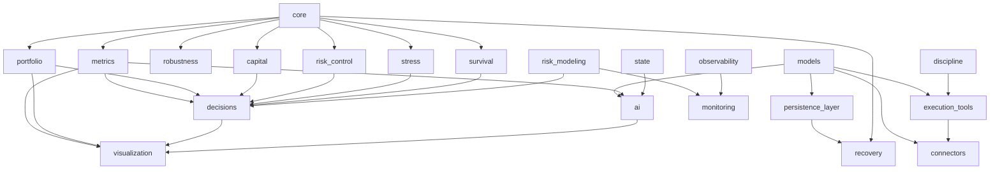
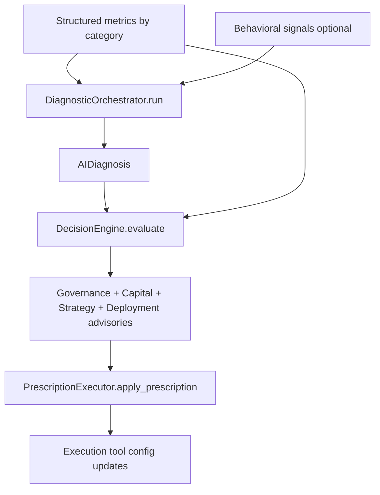
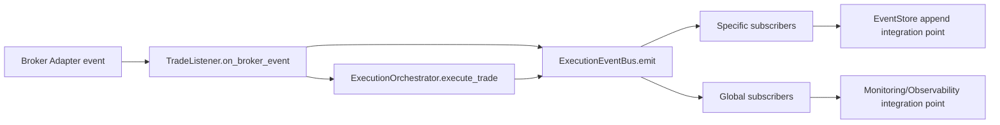
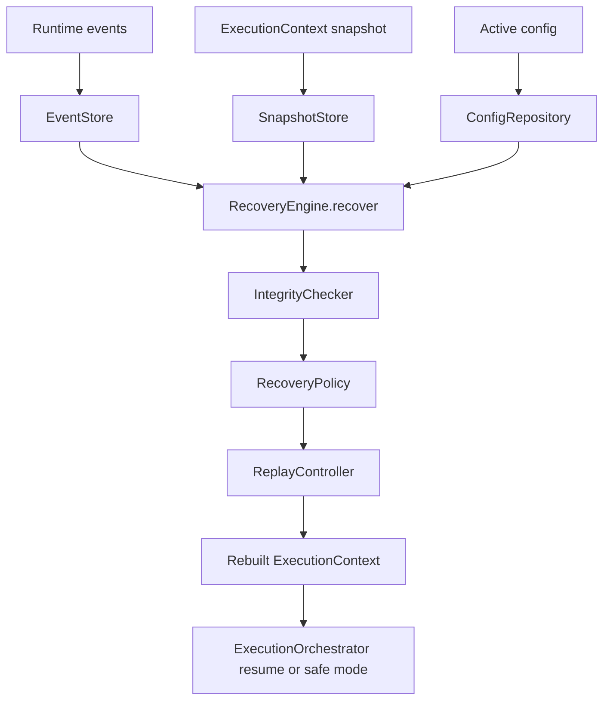
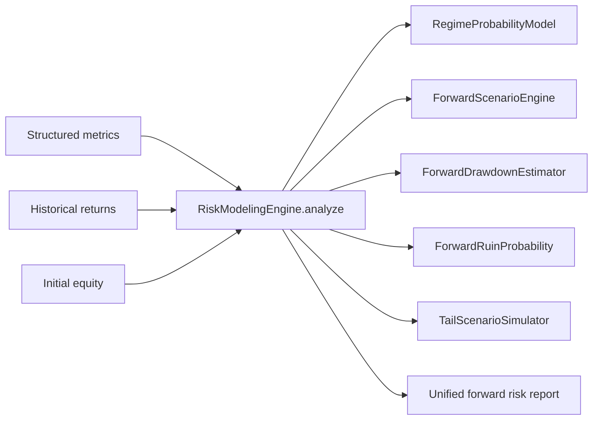
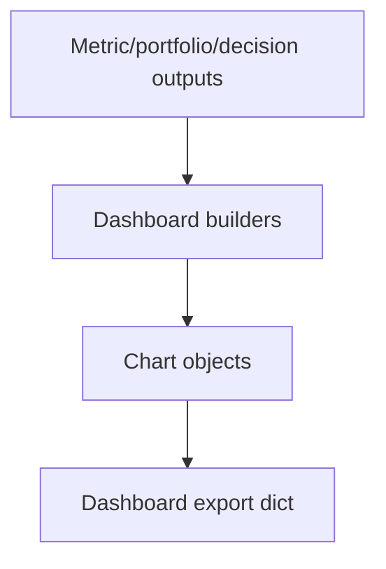

# My_Platform Architecture Blueprint

This document reflects the current codebase wiring in `/Users/apple/Desktop/My_Platform` without changing folder architecture.

## 1. Folder Dependency Graph



## 2. Runtime Boot Sequence

1. Entry starts at `/Users/apple/Desktop/My_Platform/main.py`.
2. `load_all()` in `/Users/apple/Desktop/My_Platform/load_metrics.py` imports metric packages recursively.
3. Import side effects register metrics into global `registry` in `/Users/apple/Desktop/My_Platform/core/registry.py`.
4. `registry.validate()` checks missing dependencies and DAG cycles.
5. `ExecutionEngine.run(...)` in `/Users/apple/Desktop/My_Platform/core/execution_engine.py` resolves category metrics and execution order.
6. Metrics execute with shared `ExecutionContext` from `/Users/apple/Desktop/My_Platform/core/context.py`.
7. Results, cache, errors, and timing metadata are finalized and returned.

## 3. Metric Pipeline Flow

```mermaid
flowchart LR
  A[Input Data] --> B[ExecutionContext]
  B --> C[ExecutionEngine.run]
  C --> D[Category filter or subset]
  D --> E[Registry execution_order]
  E --> F[Metric function(context)]
  F --> G[context.set_result]
  F --> H[context.set_cache]
  F --> I[context.set_error on exception]
  G --> J[Final context output]
  H --> J
  I --> J
```

Notes:
- Dependencies are metric-to-metric and enforced by registry validation.
- Metrics pass intermediate artifacts through `context.cache`.
- Category examples: `performance`, `risk`, `portfolio`, `capital`, `stress`, `survival`.

## 4. AI Decision Pipeline



Primary modules:
- Diagnostic orchestration: `/Users/apple/Desktop/My_Platform/ai/diagnostic_orchestrator.py`
- Decision orchestration: `/Users/apple/Desktop/My_Platform/decisions/decision_engine.py`
- Prescription application: `/Users/apple/Desktop/My_Platform/execution_tools/prescription_executor.py`

## 5. Event Bus Flow



Current core pieces:
- Event bus: `/Users/apple/Desktop/My_Platform/connectors/execution_event_bus.py`
- Trade routing: `/Users/apple/Desktop/My_Platform/connectors/trade_listener.py`
- Execution orchestration: `/Users/apple/Desktop/My_Platform/execution_tools/execution_orchestrator.py`

## 6. Persistence and Recovery Cycle



Key modules:
- `/Users/apple/Desktop/My_Platform/persistence_layer/event_store.py`
- `/Users/apple/Desktop/My_Platform/persistence_layer/snapshot_store.py`
- `/Users/apple/Desktop/My_Platform/recovery/recovery_engine.py`
- `/Users/apple/Desktop/My_Platform/recovery/replay_controller.py`

## 7. Risk Modeling Integration



Module anchor:
- `/Users/apple/Desktop/My_Platform/risk_modeling/risk_modeling_engine.py`

## 8. Visualization Pipeline



Examples:
- Performance dashboard: `/Users/apple/Desktop/My_Platform/visualization/performance_dashboard.py`
- Portfolio dashboard: `/Users/apple/Desktop/My_Platform/visualization/portfolio_dashboard.py`
- Chart base abstraction: `/Users/apple/Desktop/My_Platform/visualization/charts/base_chart.py`

Principle:
- Visualization modules do not compute metrics; they format already-computed results.

## 9. Future API Integration Point

Recommended stable integration seam (without architectural change):

1. Northbound API façade module (new folder `api/` can be added later) should call existing orchestrators only.
2. Keep domain engines unchanged; expose contracts around these methods:
   - `ExecutionEngine.run(...)`
   - `DiagnosticOrchestrator.run(...)`
   - `DecisionEngine.evaluate(...)`
   - `RiskModelingEngine.analyze(...)`
   - `RecoveryEngine.recover(...)`
3. Use `connectors/` as adapter boundary for broker/external streams.
4. Use `ExecutionEventBus` as async integration channel for webhook/outbox publishers.
5. Persist state only via `persistence_layer/` interfaces so API remains storage-agnostic.
6. Return typed DTOs mapped from `models/` objects to keep external schema stable.

Proposed first external endpoints:
- `POST /v1/metrics/run`
- `POST /v1/diagnosis`
- `POST /v1/decisions/evaluate`
- `POST /v1/risk-modeling/analyze`
- `POST /v1/recovery/run`
- `GET /v1/dashboard/{type}`

